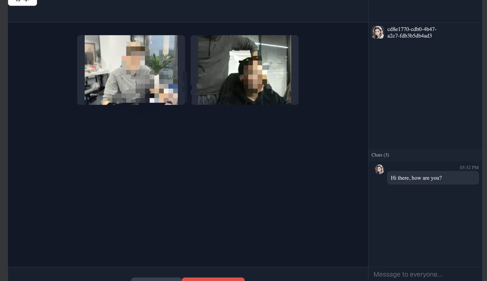

# Web 视频聊天项目

## 简介
一个基于 Web 的实时视频聊天项目，支持多人连接与实时通信。后端使用 **NestJS** 和 **MongoDB**，前端集成 WebRTC 技术，提供流畅的视频聊天体验。
## 截图



## 功能说明
- **视频聊天**：支持一对一或多人视频通话。
- **实时消息**：聊天过程中支持文本消息发送。
- **用户管理**：登录及会话管理。
- **房间功能**：创建、加入或退出聊天房间。
- **音视频设置**：支持音视频开关。

## 技术栈
- **前端**：
  - WebRTC
  - TypeScript
  - styled-components (样式管理)
- **后端**：
  - NestJS
  - MongoDB
  - WebSockets (用于实时通信)
- **其他**：
  - Docker（部署和运行）

## 安装与运行

### 环境要求
- Node.js >= 16.0
- MongoDB >= 4.4
- Docker（可选）

### 本地运行

#### 克隆仓库
```bash
git clone https://github.com/FrankWangMing/yummy.git
```

#### 安装依赖
```bash
# 前端
cd frontend
pnpm install

# 后端
cd ../backend
pnpm install
```

#### 启动服务

1. 启动后端：
   ```bash
   cd server
   pnpm run dev
   ```
2. 启动前端：
   ```bash
   cd web
   pnpm run dev
   ```

访问 `http://localhost:5173` 查看效果。


## 用法示例
在浏览器中访问项目主页，注册用户后即可创建或加入聊天房间。进入房间后，项目会自动启动摄像头，并建立 WebRTC 连接。

## 目录结构
```plaintext
├── Readme.md                     # 项目主文档
├── draft                         # 草稿目录，包含一些临时文档和图形
│   ├── readme.MD                 # 草稿版的 Readme 文件
│   └── yummy.drawio.html         # 绘图文件
├── server                        # 后端代码目录
│   ├── Dockerfile                # Docker 配置文件，用于构建后端镜像
│   ├── LICENSE                   # 许可协议文件
│   ├── README.md                 # 后端部分的说明文档
│   ├── counter.txt               # 计数器文件，可能用于存储某些信息
│   ├── deploy.sh                 # 部署脚本
│   ├── dist                       # 编译后的代码目录
│   │   ├── app.controller.js     # 控制器代码
│   │   ├── app.controller.js.map # 控制器的源映射文件
│   │   ├── app.gateway.js        # 网关代码
│   │   ├── app.gateway.js.map    # 网关的源映射文件
│   │   ├── app.module.js         # 模块代码
│   │   ├── app.module.js.map     # 模块的源映射文件
│   │   ├── common                # 公共模块代码
│   │   ├── main.js               # 主程序文件
│   │   ├── main.js.map           # 主程序的源映射文件
│   │   ├── meet                  # 与会议相关的代码
│   │   ├── room                  # 与房间相关的代码
│   │   ├── tsconfig.build.tsbuildinfo # 构建相关的配置信息
│   │   └── user                  # 用户相关的代码
│   ├── nest-cli.json             # NestJS 配置文件
│   ├── nginx                     # Nginx 配置目录
│   │   ├── nginx.conf            # Nginx 配置文件
│   │   ├── yummy.frankwm.cn.key  # SSL 密钥文件
│   │   └── yummy.frankwm.cn_bundle.crt # SSL 证书文件
│   ├── package.json              # 后端项目的 npm 包管理文件
│   ├── pnpm-lock.yaml            # pnpm 锁定的依赖文件
│   ├── src                        # 源代码目录
│   │   ├── app.controller.ts     # 控制器的 TypeScript 源码
│   │   ├── app.module.ts         # 模块的 TypeScript 源码
│   │   ├── common                # 公共模块的源代码
│   │   ├── main.ts               # 主程序的 TypeScript 源码
│   │   ├── meet                  # 会议相关的源代码
│   │   └── user                  # 用户相关的源代码
│   ├── test                       # 测试代码目录
│   │   ├── app.e2e-spec.ts       # 端到端测试文件
│   │   ├── app.resolver.e2e-spec.ts # 端到端测试的解析器文件
│   │   └── jest-e2e.json         # Jest 测试配置文件
│   ├── tsconfig.build.json       # 编译时使用的 TypeScript 配置
│   └── tsconfig.json             # TypeScript 配置文件
├── test                           # 测试项目目录
│   └── webrtc                     # WebRTC 测试相关文件夹
│       ├── README.md             # WebRTC 测试项目说明文档
│       ├── index.html            # WebRTC 测试的 HTML 文件
│       ├── package.json          # WebRTC 测试的 npm 包管理文件
│       ├── pnpm-lock.yaml        # pnpm 锁定的依赖文件
│       ├── postcss.config.js     # PostCSS 配置文件
│       ├── public                # 静态文件目录
│       ├── src                   # 源代码目录
│       ├── tailwind.config.js    # Tailwind CSS 配置文件
│       ├── tsconfig.app.json     # 应用的 TypeScript 配置
│       ├── tsconfig.json         # TypeScript 配置文件
│       ├── tsconfig.node.json    # Node.js 相关的 TypeScript 配置
│       └── vite.config.ts        # Vite 配置文件
└── web                            # 前端代码目录
    ├── Dockerfile                # Docker 配置文件，用于构建前端镜像
    ├── README.md                 # 前端部分的说明文档
    ├── counter.txt               # 计数器文件，可能用于存储某些信息
    ├── deploy.sh                 # 部署脚本
    ├── dist                       # 编译后的代码目录
    │   ├── assets                # 静态资源
    │   ├── icon                  # 图标资源
    │   ├── index.html            # 前端主页面 HTML 文件
    │   └── vite.svg              # Vite logo 图标
    ├── index.css                 # 主 CSS 文件
    ├── index.html                # 前端主 HTML 文件
    ├── nginx                     # Nginx 配置目录
    │   ├── nginx.conf            # Nginx 配置文件
    │   ├── yummy.frankwm.cn.key  # SSL 密钥文件
    │   └── yummy.frankwm.cn_bundle.crt # SSL 证书文件
    ├── package-lock.json         # npm 锁定的依赖文件
    ├── package.json              # 前端项目的 npm 包管理文件
    ├── pnpm-lock.yaml            # pnpm 锁定的依赖文件
    ├── postcss.config.js         # PostCSS 配置文件
    ├── public                    # 公共静态文件目录
    │   ├── icon                  # 图标资源
    │   └── vite.svg              # Vite logo 图标
    ├── src                        # 前端源代码目录
    │   ├── App.css               # 主样式文件
    │   ├── App.tsx               # 主组件
    │   ├── assets                # 静态资源
    │   ├── config                # 配置文件
    │   ├── core                  # 核心功能模块
    │   ├── global.less           # 全局样式文件
    │   ├── main.tsx              # 入口文件
    │   ├── model                 # 数据模型文件
    │   └── pages                 # 页面组件目录
    ├── tsconfig.app.json         # 应用的 TypeScript 配置
    ├── tsconfig.json             # TypeScript 配置文件
    └── vite.config.ts            # Vite 配置文件

```

## 贡献说明
欢迎贡献代码！
1. 提交 Issue 描述你的问题或想法。
2. Fork 仓库并创建新分支：`git checkout -b feature/your-feature`
3. 提交 Pull Request。

## 许可证
[MIT](LICENSE)

---

如果需要额外调整，例如补充功能说明或技术细节，随时告诉我！
